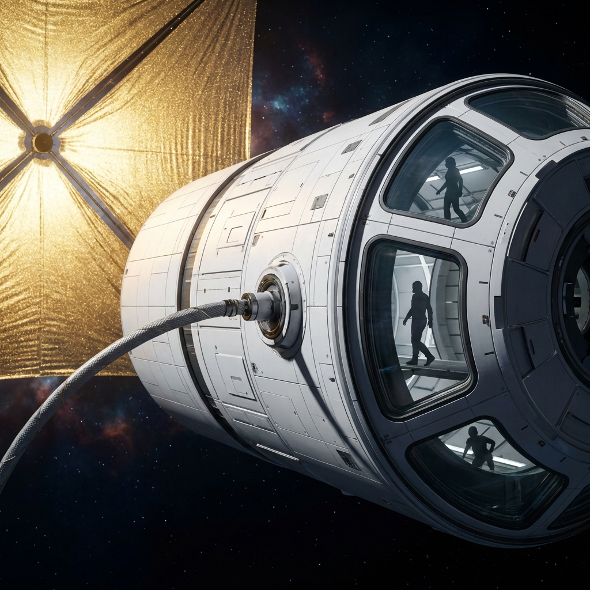

# 🚀 Interstellar Plan: Engineering Humanity's Journey to the Stars

> **Mission Statement:** A comprehensive technical blueprint for achieving relativistic interstellar travel at 1–10% the speed of light using existing or near-term technology.

---

## 📋 Table of Contents

- [Overview](#overview)
- [Project Goals](#project-goals)
- [Two Viable Approaches](#two-viable-approaches)
  - [Approach 1: Project Longshot (Nuclear Pulse Propulsion)](#approach-1-project-longshot-nuclear-pulse-propulsion)
  - [Approach 2: The Stellar Highway (Laser Propulsion)](#approach-2-the-stellar-highway-laser-propulsion)
- [Critical Systems](#critical-systems)
  - [Deceleration Strategy](#deceleration-strategy)
  - [Radiation & Impact Shielding](#radiation--impact-shielding)
  - [Artificial Gravity](#artificial-gravity)
- [The Antimatter Upgrade (Generation 2)](#the-antimatter-upgrade-generation-2)
- [Cost Analysis](#cost-analysis)
- [Global Collaboration Strategy](#global-collaboration-strategy)
- [Repository Structure](#repository-structure)
- [Visualizations](#visualizations)
- [Contributing](#contributing)
- [License](#license)

---

## 🌌 Overview

This repository contains a detailed engineering analysis and implementation plan for humanity's first interstellar missions. The project explores two fundamentally different but equally viable approaches to reaching **1% of light speed** (approximately **3,000 kilometers per second**), the minimum velocity required for meaningful interstellar travel within human timescales — and a **Generation 2 upgrade** using antimatter-catalyzed fusion that pushes to **10% of light speed**, enabling single-lifetime voyages.

### Why 1% Light Speed?

- **Proxima Centauri** (4.24 light-years away) becomes reachable in ~400 years
- **Alpha Centauri System** accessible within similar timeframes
- Enables multi-generational "ark ships" or fast robotic probes
- Falls within the realm of known physics and engineering

### Why 10% Light Speed? (Gen 2)

- **Proxima Centauri** in **~45 years** — a single human lifetime
- The crew that launches is the crew that arrives
- Requires antimatter-catalyzed fusion (feasible by ~2070s)

### Core Philosophy

**"Money is no object when survival is at stake."**

This project assumes an existential imperative—whether planetary defense, species preservation, or scientific exploration—that justifies extraordinary resource allocation. However, the analysis demonstrates that the mission is surprisingly **affordable** for a Type I civilization.

---

## 🎯 Project Goals

1. **Demonstrate Technical Feasibility** using current or near-term technology (TRL 6-8)
2. **Provide Detailed Engineering Specifications** for mission-critical systems
3. **Calculate Realistic Cost Estimates** for planetary-scale collaboration
4. **Establish Scalable Infrastructure** that enables repeated missions
5. **Identify Critical Path Dependencies** for accelerated timelines
6. **Solve the Complete Mission Problem** — not just "how to go fast" but how to stop, survive, and arrive

---

## 🛸 Two Viable Approaches

### Approach 1: Project Longshot (Nuclear Pulse Propulsion)

**The Brute Force Solution**


#### Overview
Project Longshot (also called "Super Orion") uses controlled nuclear detonations to propel a massive interstellar ark to relativistic speeds. This approach is based on the 1958 Project Orion concept, extensively studied by Freeman Dyson and the General Atomics team.

#### Key Specifications

| Parameter | Value |
|-----------|-------|
| **Propulsion Method** | Nuclear Pulse (Fusion-Catalyzed Charges) |
| **Top Speed** | 3,000 km/s (1.0% c) |
| **Acceleration** | 1g (9.8 m/s²) |
| **Time to Speed** | 3.5 days |
| **Payload Capacity** | 100,000 metric tons |
| **Total Launch Mass** | 6,000,000 metric tons (with deceleration fuel) |
| **Mass Ratio** | 60:1 (partial reverse burn + magsail) |
| **Pulse Units Required** | 6,000,000 devices |
| **Pulse Yield** | 1-5 kilotons per device |
| **Firing Rate** | 7 Hz (7 detonations/second) |
| **Exhaust Velocity** | 1,000 km/s |

#### The Physics

Using the **Tsiolkovsky Rocket Equation**:

📄 **Full details:** [project_longshot.md](project_longshot.md)

---

### Approach 2: The Stellar Highway (Laser Propulsion)

**The Scalable Solution**


#### Overview
The Stellar Highway uses an orbital laser phased array to push a light sail to relativistic speeds. Unlike nuclear pulse, the "engine" stays home — the ship carries no fuel, only a reflective sail.

#### Key Specifications

| Parameter | Value |
|-----------|-------|
| **Propulsion Method** | 100 GW Orbital Phased Laser Array |
| **Top Speed** | 3,000 km/s (1.0% c) |
| **Sail Material** | Corrugated Alumina/MoS₂ Nanolaminate (Campbell 2025) |
| **Sail Stability** | Photonic Metasurface (Lin 2025) |
| **Payload** | 100 tons (crewed) |
| **Total Sail Area** | 4 km² |
| **Acceleration Duration** | 200 days |

📄 **Full details:** [stellar_highway.md](stellar_highway.md) | [integrated_photonic_architecture.md](integrated_photonic_architecture.md)

---

## 🛡️ Critical Systems

### Deceleration Strategy

**"How do you stop?"** — The most critical question in interstellar mission design.

At 1% c, you blow through the entire Alpha Centauri system in 6 hours. This plan uses a **hybrid two-phase deceleration** system:

1. **Forward Staged Sail / Partial Reverse Burn** — Primary braking from 1% c to 0.1% c
2. **Magnetic Sail (Magsail)** — A 100 km superconducting loop creates a "magnetic parachute" in the interstellar medium, autonomously braking to orbital velocity

📄 **Full details:** [deceleration_strategy.md](deceleration_strategy.md)

---

### Radiation & Impact Shielding

At 3,000 km/s, every hydrogen atom hits with 47 keV (X-ray energy). The ship receives ~1.4 MW of forward radiation. Our **four-layer defense in depth** system keeps crew radiation dose below occupational limits:

1. **Magsail magnetosphere** — Deflects 90% of charged particles
2. **Nanolaminate sail** — Forward particle/dust barrier
3. **5-meter water ice shield** — Reduces GCR dose by 98%; also serves as water reserve
4. **Whipple bumper + polyethylene** — Final fragment/neutron capture layer

**Total shield erosion over 400 years: <1 kg.** The crew is safe.

📄 **Full details:** [radiation_shielding.md](radiation_shielding.md)

---

### Artificial Gravity

The **Gemini Tethered Centrifuge** provides 1g gravity during the cruise phase:

- Two 50-ton habitat modules ("Castor" and "Pollux")
- Connected by a 450m Zylon tether
- Spinning at 2 RPM (below Coriolis nausea threshold)
- De-spun magnetic bearing connects to sail/shield

📄 **Full details:** [artificial_gravity_addendum.md](artificial_gravity_addendum.md)

---

## ⚛️ The Antimatter Upgrade (Generation 2)

**Antimatter-Catalyzed Fusion** transforms the mission from a 400-year multi-generational ark to a **45-year single-lifetime voyage** at 10% c.

| | Gen 1 (Laser/Nuclear) | **Gen 2 (Antimatter Hybrid)** |
|---|---|---|
| **Speed** | 1% c | **10% c** |
| **Trip time** | ~440 years | **~45 years** |
| **Engine** | Photon pressure / nuclear pulse | Laser boost + AcICF |
| **Antimatter needed** | 0 | 10.4 milligrams |
| **Earliest launch** | 2040s | **2070s** |

📄 **Full details:** [antimatter_upgrade_path.md](antimatter_upgrade_path.md)

---

## 💰 Cost Analysis

| Component | Cost (Single Nation) | Cost (Global Collaboration) |
|---|---|---|
| Laser Array (100 GW) | $3 Trillion | $1 Trillion |
| Vessel + Sail | $250 Billion | $150 Billion |
| Deceleration Systems | $270 Billion | $150 Billion |
| Radiation Shielding | $20 Billion | $15 Billion |
| Operating Costs | $50 Billion | $50 Billion |
| **Gen 1 Total** | **~$3.6 Trillion** | **~$1.4 Trillion** |
| Antimatter Upgrade (Gen 2) | +$1 Trillion | +$500 Billion |

📄 **Full details:** [cost_analysis.md](cost_analysis.md) | [global_collaboration_strategy.md](global_collaboration_strategy.md)

---

## 📁 Repository Structure

```
Interstellar_Plan-/
├── README.md                           # This file — project overview
├── project_longshot.md                 # Approach 1: Nuclear Pulse Propulsion
├── stellar_highway.md                  # Approach 2: Laser Propulsion Roadmap
├── integrated_photonic_architecture.md # Research integration (Campbell/Lin/Lubin)
├── deceleration_strategy.md            # ★ How to stop: staged sail + magsail
├── radiation_shielding.md              # ★ 4-layer defense against ISM radiation
├── antimatter_upgrade_path.md          # ★ Gen 2: AcICF engine for 10% c
├── artificial_gravity_addendum.md      # Gemini tethered centrifuge system
├── cost_analysis.md                    # Financial breakdown ($1-3.5T)
├── global_collaboration_strategy.md    # ISRO/SpaceX/ESA collaboration model
├── walkthrough.md                      # Visual mission gallery
└── *.png                              # Concept art and visualizations
```

*★ = New documents completing the mission architecture*

---

## 🎨 Visualizations

| Image | Description |
|-------|-------------|
|  | The Corrugated Clipper exterior |
|  | Arrival at Proxima Centauri |

📄 **Full gallery:** [walkthrough.md](walkthrough.md)

---

## 🤝 Contributing

This is an open-source mission architecture. Contributions are welcome in:

- **Physics verification** — Check the math, find errors, tighten the models
- **Engineering trade studies** — Propose alternative designs for any subsystem
- **Cost analysis refinement** — Update estimates with current industry data
- **Visualization** — Concept art, CAD models, mission animations
- **Simulation** — Trajectory optimization, thermal models, structural analysis

---

## 📜 License

This work is released for the benefit of humanity. Use it, build on it, make it real.
